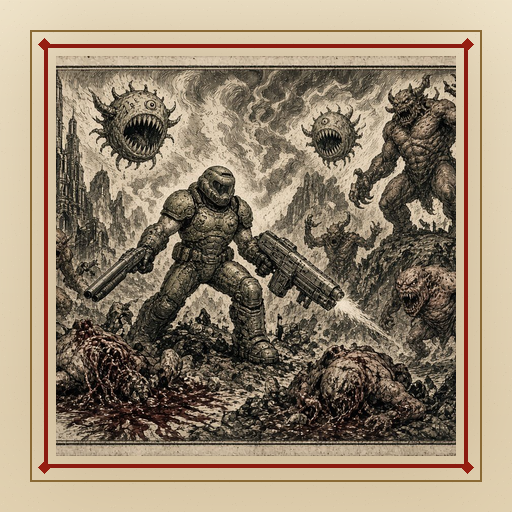
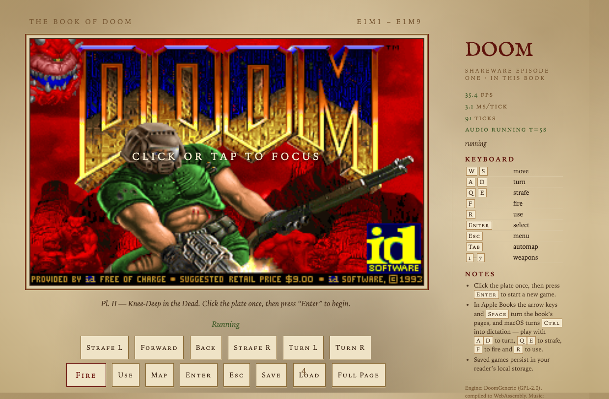
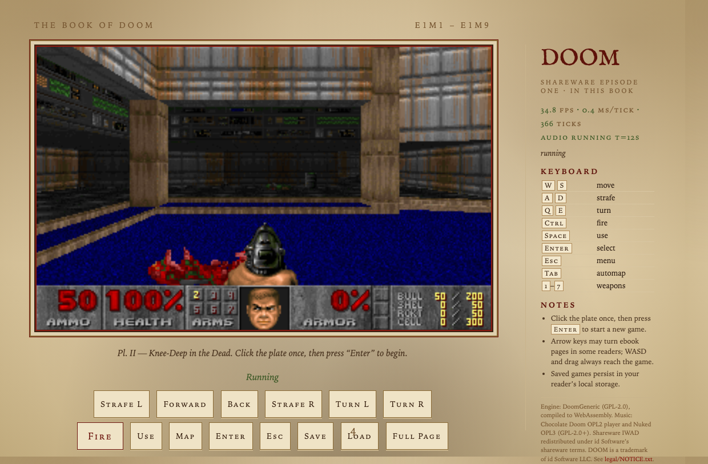

<p align="center">
  
</p>

# doom.epub

[](https://github.com/artemkulyk/doom_epub/actions/workflows/ci.yml)
[](https://github.com/artemkulyk/doom_epub/releases/latest)
[](LICENSE)

**A real ebook that runs real DOOM.**


`doom.epub` is a single, standards-valid EPUB 3 file. Open it in an ordinary ebook
reader, turn one page, and you are playing the 1993 shareware episode of DOOM -
the actual engine, compiled to WebAssembly, rendering into a framebuffer, running
entirely inside the reader. No network access, no plugins, no external files, no
modified reader, no developer mode.

```
dist/doom.epub   ~3.4 MB   EPUB 3.3, fixed layout, scripted
```

## What it does

- **DoomGeneric** (portable DOOM engine, GPL-2.0) compiled with Emscripten to
  WebAssembly, with a custom EPUB platform layer: JS-driven ticks at the
  authentic 35 Hz, zero-copy RGBA framebuffer blit into a canvas.
- **Sound effects and music** through the SDL2/SDL_mixer Emscripten audio
  ports. Music uses Chocolate Doom's OPL2 player with the Nuked OPL3
  emulator, driven by the WAD's own GENMIDI instruments - no extra
  instrument data is bundled and the classic Adlib soundtrack is authentic.
- **Keyboard, mouse and touch**: `W`/`S` move, `A`/`D` turn, `Q`/`E` strafe,
  `F` fire, `R` use; pointer-drag turning and on-screen buttons for touch
  devices.
- **Save games** stored inside the reader's localStorage and restored when you
  return to the page, even if the reader reloads the document.
- **Theater mode** ("BIG" button) that scales the game to the page and hides
  the side panel.
- **One book flow**: cover, "this is a real ebook" introduction, then the game.

Only legally redistributable game data is used: the official DOOM shareware IWAD
(E1M1-E1M9), redistributed under id Software's shareware terms.

## Quick start

1. Download `doom.epub` from
   [the latest release](https://github.com/artemkulyk/doom_epub/releases/latest)
   (or build it, below).
2. Open it the way you open any ebook:
   - **Apple Books (macOS)**: double-click the file.
   - **Thorium Reader**: File > Import, then open from the library.
   - **Calibre**: drag it into the library and use the built-in viewer
     (on some macOS versions the viewer needs
     `QTWEBENGINE_CHROMIUM_FLAGS="--no-sandbox --disable-gpu"`;
     see `docs/COMPATIBILITY.md`).
3. Turn to the game page (III), click/tap the screen once so the page has
   keyboard focus, and press **Enter** to start a new game.

Every release is built from the tagged source by GitHub Actions; the release
workflow builds the engine and EPUB twice and refuses to publish unless both
builds are byte-for-byte identical. See `.github/workflows/`.

## Screenshots

<p>
  
  
</p>

## Controls

| Input | Action |
| --- | --- |
| `W` `S` | move forward / back |
| `A` `D` | turn left / right |
| `Q` `E`, or mouse/touch drag | strafe left / right |
| `F` or click/tap | fire |
| `R` | use / open doors |
| `Enter` | menu select |
| `Esc` | menu |
| `Tab` | automap |
| `1`-`7` | switch weapon |
| `F2` / `F3` | save / load game |

Arrow keys and `Space` also move/turn and use where readers allow them, but
Apple Books intercepts both for page navigation, and macOS turns `Ctrl` into
dictation — the letters above always reach the game.

## How it works

```
 EPUB container
  +-- cover, about, game (fixed-layout XHTML)
  +-- js/player.js      loader, input, framebuffer blit, save sync
  +-- js/doom.js        Emscripten glue
  +-- assets/doom.wasm  DoomGeneric + SDL2 audio + OPL2 music (~1.2 MB)
  +-- assets/doom1.wad  shareware IWAD (~4.2 MB)
```

The game page is a pre-paginated 1200x800 XHTML document. The player loads
`doom.wasm` and `doom1.wad` with XHR (chosen because scripted EPUB readers are
more permissive with XHR than `fetch`), writes the IWAD into Emscripten's
in-memory filesystem, instantiates the engine through `instantiateWasm`, and
then calls one engine tick per 1/35 s from `requestAnimationFrame`. The engine's
RGBA8888 framebuffer lives in WebAssembly memory and is wrapped in an `ImageData`
object without copying, then drawn to a canvas scaled by the reader.

There are two deliberately small engine patches (see `engine/patches/`):

1. make the framebuffer pixels opaque (upstream targets SDL textures, which
   ignore alpha);
2. give unnamed save games a default description, because reader users cannot
   easily type into DOOM's text field.

## Measured performance

Chromium (Apple Silicon, headless, sound build):

| Metric | Value |
| --- | --- |
| Engine tics/sec | 35.0 (authentic) |
| Rendered FPS | ~35.9 (one new frame per engine tic) |
| Engine tick time | 0.3-0.5 ms |
| Boot (wasm + WAD + init) | ~70 ms localhost |
| 60 s sustained run | 2100/2100 tics, 0 errors |
| EPUB size | ~3.4 MB |

See `docs/COMPATIBILITY.md` for per-reader results and `docs/BUILDING.md` to
build from source.

## Repository layout

```
web/app/          EPUB XHTML/CSS/OPF sources
web/src/player.js player core (ES5, no dependencies)
web/engine/       platform shim + build script for the engine
engine/patches/   small patches applied to DoomGeneric at build time
packaging/        EPUB assembler; tools/cover_art.py authors the cover
tools/            WAD fetcher, CDP test driver, cover/font rendering
prototype/        the original EPUB feasibility test that started this project
docs/             build and compatibility documentation
.github/          GitHub Actions: CI build and tag-driven releases
```

## Legal

- Engine: [DoomGeneric](https://github.com/ozkl/doomgeneric), GPL-2.0.
- Music: [Chocolate Doom](https://www.chocolate-doom.org/) OPL player and
  the Nuked OPL3 emulator (GPL-2.0+, vendored in `web/engine/opl/`).
- Game data: DOOM shareware episode 1, © 1993-1996 id Software LLC,
  redistributed under id Software's shareware terms.
- DOOM is a registered trademark of id Software LLC. This project is not
  affiliated with or endorsed by id Software or ZeniMax/Bethesda.
- The GPL requires source availability: this repository contains the complete
  corresponding source, build scripts and patches. See `web/app/legal/NOTICE.txt`.
